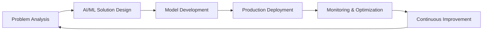

<div align="center">

# 🚀 Tanvir Mahmud Tushar

### MLOps Engineer | GenAI Specialist | AI Research Enthusiast

*Building intelligent systems that make a difference*

[](https://github.com/TanvirMahmudTushar)
[](https://twitter.com/tanvirmahmud007)
[](https://linkedin.com/in/tanvir-mahmud007/)


---

### 💫 *"Transforming ideas into intelligent solutions through AI and Machine Learning"*

</div>

## 🎯 Professional Summary

**Passionate MLOps and GenAI Engineer** specializing in building production-ready AI systems that solve real-world problems. Currently developing **Bondhu**, an AI-powered social robot designed to improve mental well-being, education, and safety in Bengali-speaking communities.

```python
class TanvirMahmudTushar:
    def __init__(self):
        self.role = "MLOps & GenAI Engineer"
        self.location = "Chittagong, Bangladesh"
        self.education = "Computer Science & Engineering"
        self.focus_areas = [
            "Machine Learning Operations (MLOps)",
            "Generative AI & Large Language Models",
            "Full-Stack Development",
            "Social Robotics & HRI"
        ]
        
    def current_project(self):
        return {
            "name": "Bondhu - A Social Robot",
            "impact": "Mental Well-being & Education",
            "target": "Bengali-Speaking Communities",
            "tech_stack": ["Python", "GenAI", "NLP", "Robotics", "TensorFlow"],
            "url": "https://sites.google.com/view/bondhu-a-social-robot/"
        }
    
    def core_competencies(self):
        return {
            "AI/ML": ["Deep Learning", "NLP", "Computer Vision", "LLMs"],
            "MLOps": ["Model Deployment", "CI/CD", "Monitoring", "Optimization"],
            "Development": ["Python", "Django", "React", "Node.js"],
            "Tools": ["TensorFlow", "PyTorch", "Docker", "Git", "PostgreSQL"]
        }
    
    def professional_mindset(self):
        return "Continuous learner | Problem solver | Team collaborator"
```

<div align="center">

[](https://git.io/typing-svg)

</div>

## 🔭 Current Focus

### 🤖 [Bondhu: A Social Robot for Bengali Communities](https://sites.google.com/view/bondhu-a-social-robot/)

Leading the development of an AI-powered social robot designed to address critical needs in Bengali-speaking communities:

- **Mental Well-being**: Providing emotional support and companionship
- **Educational Support**: Facilitating interactive learning experiences
- **Safety & Security**: Ensuring user safety through intelligent monitoring

**Technologies**: Python • Generative AI • Natural Language Processing • Robotics • TensorFlow • Computer Vision

---

## 💡 Areas of Expertise

<div align="center">

| Domain | Technologies & Skills |
|:---:|:---|
| 🤖 **Machine Learning** | Deep Learning, Neural Networks, Model Training, Computer Vision, NLP |
| ⚙️ **MLOps** | Model Deployment, Pipeline Automation, Performance Monitoring, A/B Testing |
| 🧠 **Generative AI** | Large Language Models, Prompt Engineering, RAG Systems, Fine-tuning |
| 💻 **Backend Development** | Python, Django, REST APIs, Database Design, Microservices |
| 🎨 **Frontend Development** | React, JavaScript, HTML/CSS, Bootstrap, Responsive Design |
| 🗄️ **Databases** | PostgreSQL, MySQL, Database Optimization, Query Performance |
| 🛠️ **DevOps & Tools** | Git, Docker, Linux, CI/CD, Cloud Platforms |
| 🤝 **Soft Skills** | Problem Solving, Team Collaboration, Research, Technical Communication |

</div>

## 🛠️ Technical Skills & Tools

<div align="center">

### 🧠 AI/ML & Data Science


### 💻 Programming Languages


### 🌐 Web Development


### 🗄️ Databases & Backend


### ⚙️ DevOps & Tools


### 🎨 Design & Creative Tools


### 🤖 Hardware & Embedded


</div>

## 📊 GitHub Analytics

<div align="center">

<a href="https://github.com/TanvirMahmudTushar">
  
  
</a>

</div>

<div align="center">
  
[](https://github.com/TanvirMahmudTushar)

</div>

<div align="center">


</div>

## 🎓 Education & Learning Journey

```
🎯 Currently Learning: Advanced GenAI Architectures, LLM Fine-tuning, Production MLOps
📚 Focus Areas: Transformer Models, Reinforcement Learning, Distributed Systems
🔬 Research Interest: Human-Robot Interaction, Social AI, Mental Health Tech
```

## 🏆 Professional Highlights

<div align="center">

| Achievement | Impact |
|:---|:---|
| 🤖 **Bondhu Social Robot** | Leading AI research project for mental well-being in Bengali communities |
| 💡 **GenAI Applications** | Building production-ready generative AI solutions |
| 🎓 **Continuous Learning** | Active learner in cutting-edge AI/ML technologies |
| 🌐 **Open Source Contributor** | Contributing to the developer community |
| 📊 **MLOps Practitioner** | Implementing scalable ML deployment pipelines |

</div>

## 💼 Let's Connect & Collaborate

<div align="center">

### 📬 Open to Opportunities

I'm actively seeking opportunities and collaborations in:
- 💼 **Full-time Positions** in MLOps, GenAI Engineering, or AI/ML Development
- 🤝 **Freelance Projects** involving AI/ML implementation
- 🔬 **Research Collaborations** in Social Robotics and AI for Social Good
- 💡 **Open Source Contributions** in AI/ML projects
- 🎓 **Knowledge Sharing** and technical mentorship

<br>

[](mailto:6209tanvir@gmail.com)
[](https://linkedin.com/in/tanvir-mahmud007/)
[](https://github.com/TanvirMahmudTushar)
[](https://twitter.com/tanvirmahmud007)

[](https://www.youtube.com/c/@cswithtanvir)
[](https://kaggle.com/tanvirmahmud2321648)
[](https://www.hackerrank.com/thecapedcrusader)

<br>

### 📧 **Email:** [6209tanvir@gmail.com](mailto:6209tanvir@gmail.com)
### 💼 **LinkedIn:** [linkedin.com/in/tanvir-mahmud007](https://linkedin.com/in/tanvir-mahmud007/)
### 📍 **Location:** Chittagong, Bangladesh
### 🌍 **Available for:** Remote, Hybrid, and On-site Opportunities

</div>

## 💬 Technical Discussions Welcome

I'm always happy to discuss:
- 🤖 Machine Learning Operations (MLOps) and deployment strategies
- 🧠 Large Language Models, RAG systems, and Generative AI
- 🔄 Best practices in AI/ML production systems
- 🐍 Python development for AI/ML applications
- 🌐 Full-stack development with modern frameworks
- 🦾 Robotics, embedded systems, and IoT
- 📊 Data science and analytics workflows

## 🚀 Featured Projects & Research

<div align="center">

<table>
<tr>
<td width="50%">

### 🤖 Bondhu - Social Robot
[](https://sites.google.com/view/bondhu-a-social-robot/)

AI-powered social companion designed for Bengali-speaking communities, focusing on mental well-being, education, and safety.

**Key Features:**
- 🧠 Mental health support & companionship
- 📚 Interactive educational assistance  
- 🛡️ User safety monitoring
- 💬 Natural language understanding in Bengali

**Tech Stack:**  
`Python` `Generative AI` `NLP` `TensorFlow` `Robotics` `Computer Vision`

**Impact:** Addressing critical social needs through accessible AI technology

</td>
<td width="50%">

### 💡 More Projects Coming Soon!

Currently working on:
- 🔮 **GenAI Applications** - Production-ready LLM solutions
- 📊 **MLOps Pipeline** - Automated model deployment system
- 🌐 **Full-Stack AI Apps** - Intelligent web applications

**Areas of Development:**
- Machine Learning Model Deployment
- Generative AI Implementations
- Computer Vision Applications
- Natural Language Processing Solutions

*Check back for updates on new projects!*

</td>
</tr>
</table>

</div>

## 📈 What I Can Bring to Your Team

<div align="center">



</div>

### 🎯 Core Strengths

- **🤖 End-to-End ML Development**: From data preprocessing to model deployment and monitoring
- **⚡ Rapid Prototyping**: Quick POCs and MVPs for validating AI solutions
- **🔧 Production-Ready Code**: Clean, maintainable, and scalable implementations
- **📚 Research-Oriented**: Stay updated with latest AI/ML advancements
- **🤝 Collaborative Mindset**: Experience in cross-functional team environments
- **💡 Problem Solving**: Strong analytical and troubleshooting skills

## 📫 How to Reach Me

- 📧 Email: **6209tanvir@gmail.com**
- 💼 LinkedIn: **[tanvir-mahmud007](https://linkedin.com/in/tanvir-mahmud007/)**
- 🐦 Twitter: **[@tanvirmahmud007](https://twitter.com/tanvirmahmud007)**
- 📺 YouTube: **[CS with Tanvir](https://www.youtube.com/c/@cswithtanvir)**


---

<div align="center">

### 🌟 *"Committed to building AI solutions that create positive impact"*

<br>

## 🎯 Ready to Collaborate?

Whether you're looking for an **MLOps Engineer**, **GenAI Specialist**, or **Full-Stack AI Developer**, I'm ready to bring value to your team!

### 📩 **Let's Talk:** [6209tanvir@gmail.com](mailto:6209tanvir@gmail.com)

<br>


### ⭐ **If you find my work interesting, star my repositories!**
### 🔔 **Follow me for updates on AI/ML projects**

<br>

**Thank you for visiting my profile! Let's build something amazing together! 🚀**

<br>

<sub>💡 **Pro tip:** Check out my pinned repositories below for my latest work!</sub>

<br>


---

<sub>⚡ **Fun fact:** I work best with a cup of coffee ☕ and challenging problems to solve!</sub>

</div>
